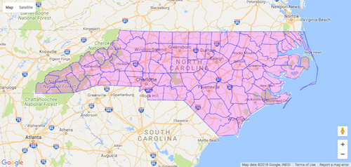

The goal of **googlePolylines** is to encode and decode coordinates using [Google's polyline encoding algorithm](https://developers.google.com/maps/documentation/utilities/polylinealgorithm)

> Polyline encoding is a lossy compression algorithm that allows you to store a series of coordinates as a single string. 


Encoded polylines are used by Google Maps to draw lines and polygons, and are therefore supported in the [googleway](https://CRAN.R-project.org/package=googleway) package. 

I am intending to update `googleway` to support plotting `sf` objects using these encoded polylines.


## Caution

The word **lossy** is important to keep in mind, as the encoding process could reduce precision of your data. If you are after highly accurate coordinates this process probably isn't for you. 

However, if you need to reduce the size of spatial objects/data, and want quicker plots (see the **Benchmarking** section), then this could help.


## Encoding

Encoding is split across two functions

- `encode(obj)` - designed for use on `sf` objects and `data.frames`
- `encodeCoordinates(lon, lat)` - designed to encode vectors of coordinates


### vectors

Given two vectors of longitude and latitude coordinates:

```{r}
library(googlePolylines)

lon <- c(144.9709, 144.9713, 144.9715, 144.9719, 144.9728, 144.9732, 
144.973, 144.9727, 144.9731, 144.9749, 144.9742)

lat <- c(-37.8075, -37.8076, -37.8076, -37.8078, -37.8079, -37.8079, 
-37.8091, -37.8107, -37.8115, -37.8153, -37.8155)

encodeCoordinates(lon, lat)

```


### data.frame

The `encode()` function will attempt to find the lon & lat columns inside a data.frame using regex matching. However, you can also specify the columns of coordinates:

```{r}

df <- data.frame(
  lon = c(144.9709, 144.9713, 144.9715, 144.9719, 144.9728, 144.9732, 144.973, 144.9727, 144.9731, 144.9749, 144.9742),
  lat = c(-37.8075, -37.8076, -37.8076, -37.8078, -37.8079, -37.8079, -37.8091, -37.8107, -37.8115, -37.8153, -37.8155)
  )

encode(df)

## or specify the columns to use
# encode(df, lon = "lon", lat = "lat")

```


### sf

`encode()` will currently work on `sf` objects with geometry types

- POINT
- MULTIPOINT
- LINESTRING
- MULTILINESTRING
- POLYGON
- MULTIPOLYGON

It will not work on GEOMETRYCOLLECTION objects.

```{r}

library(sf)

## data set of North Carolina states
nc <- sf::st_read(system.file("shape/nc.shp", package="sf"))
nc[1:5,]

```

When used on an `sf` object, an `sfencoded` object is returned, with the encoded polylines replacing the `sf::st_geometry` column. 

```{r}
enc <- encode(nc)
str(enc)

attr(enc, "encoded_column")

enc[1, attr(enc, "encoded_column")]

```

As you can see, the geometry attributes are kept on the encoded object. However, you can remove them by specifying `strip = TRUE`

```{r}
encLite <- encode(nc, strip = T)
str(encLite)

encLite[1, attr(encLite, "encoded_column")]

```


The benefit of stripping the attributes is to reduce the size of the object, which can be useful for web plotting if bandwidth/data transfer speeds are an issue.

```{r}
vapply(mget(c('nc', 'enc', 'encLite') ), function(x) { format(object.size(x), units = "Kb") }, '')

```


## Well-known Text

The two functions `polyline_wkt` and `wkt_polylne` can be used to convert `sfencoded` objects to and from well-known text.

```{r}

wkt <- polyline_wkt(enc)
wkt[1, ]

```


```{r}
enc2 <- wkt_polyline(wkt)
enc2[1, ]

```

I've provided these functions to enable the conversion of encoded polylines into other geometry formats, should they be required by other packages.  

### Converting to sf

`sf` can read well-known text, so you can convert the wkt object back to `sf` / `sfc` objects

```{r}

# sfc from wkt
st_as_sfc(wkt$geometry)

## back to sf - use `as.data.frame` to remove sfencoded attributes
sf_wkt <- as.data.frame(wkt)
sf_wkt$geometry <- st_as_sfc(sf_wkt$geometry)
sf_wkt <- st_sf(sf_wkt)
  
head(sf_wkt[, c("AREA", "PERIMETER", "geometry")])

```

## Decoding

Use `decode()` to decode polylines into coordinates. This function will return a list of data.frames with lon/lat column.

```{r}
polylines <- c(
 "ohlbDnbmhN~suq@am{tAw`qsAeyhGvkz`@fge}A",
 "ggmnDt}wmLgc`DesuQvvrLofdDorqGtzzV"
)

decode(polylines)

```


## Benchmarking

You will note that the encoded strings are different between the two `enc` objects created earlier. For example

```{r}
enc[1, 'geometry'][[1]] == enc2[1, 'geometry'][[1]]
```

This results from the **lossy**-ness of the encoding. However, the general shape of the information is preserved. These two maps are plots of the `enc` and `enc2` objects respectively:

```
library(googleway)

## You'll need a Google Map API key to run this code
mapKey <- "your_api_key"

google_map(key = mapKey) %>%
  add_polygons(data = nc, polyline = "geometry", fill_colour = "#00FF00", fill_opacity = 0.2)

```


```
google_map(key = mapKey) %>%
  add_polygons(data = enc2, polyline = "geometry", fill_colour = "#FF00FF", fill_opacity = 0.2)
```



### Plotting

This benchmark compares plotting an `sf` object through **leaflet** vs plotting the encoded object through **googleway**

```

library(microbenchmark)
library(leaflet)

microbenchmark(

  goog = { 
    google_map(key = mapKey) %>%
      add_polygons(data = enc, polyline = "polyline")
      },
      
  leaf = { 
    leaflet() %>%
      addTiles() %>%
      addPolygons(data = nc)
    }, 
    times = 25
)

Unit: milliseconds
 expr       min        lq      mean    median        uq        max neval
 goog  5.457699  5.972203  6.379053  6.162676  6.467225   8.876789   100
 leaf 29.915151 32.093100 34.251388 33.088324 34.629769 106.124047   100
 
```

These benchmarks don't account for the time taken for the browswer to render the maps


